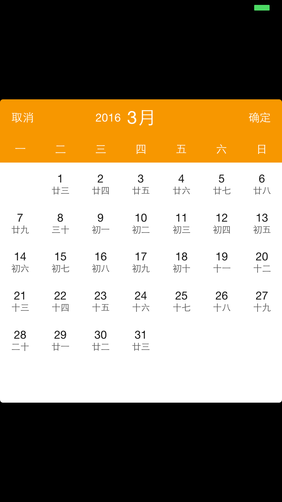

# BXCalendar

[](https://travis-ci.org/banxi1988/BXCalendar)
[](http://cocoapods.org/pods/BXCalendar)
[](http://cocoapods.org/pods/BXCalendar)
[](http://cocoapods.org/pods/BXCalendar)

[

## Usage


```swift
let vc = BXCalendarDatePickerController()
vc.updateSelectedDates([NSDate()])
vc.didSelectedDates = { dates in
}

presentViewController(vc, animated: true, completion: nil)
```

To run the example project, clone the repo, and run `pod install` from the Example directory first.

## Requirements

## Installation

BXCalendar is available through [CocoaPods](http://cocoapods.org). To install
it, simply add the following line to your Podfile:

```ruby
pod "BXCalendar"
```

If Swift 2.2 then use `0.1.3` else if Swift 3 then use the latest version.

## Author

banxi1988, banxi1988@gmail.com

## License

BXCalendar is available under the MIT license. See the LICENSE file for more info.
